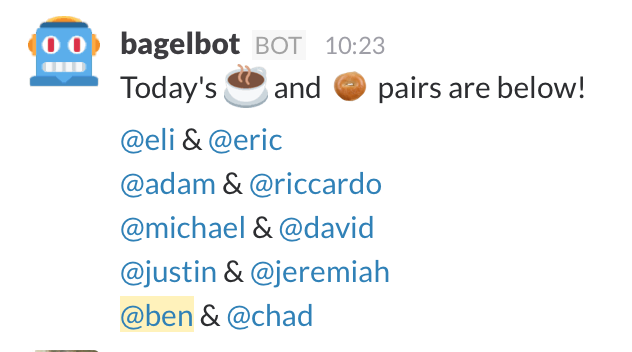
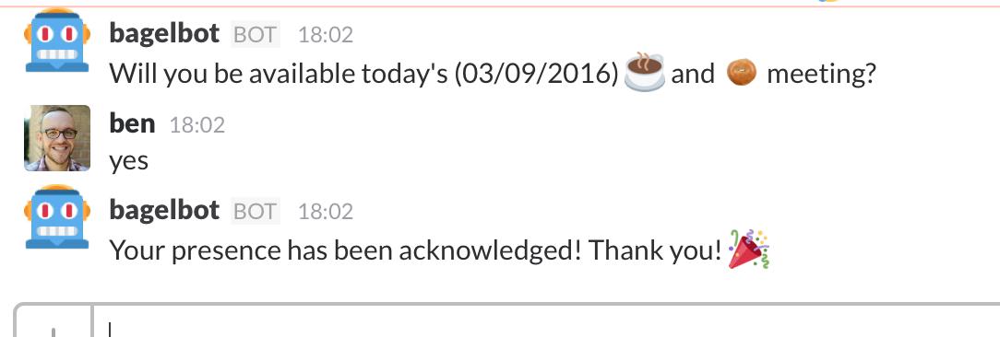
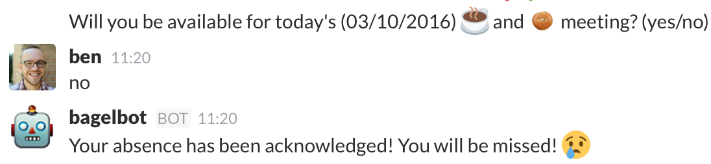

bagelbot
========

*Your friendly neighborhood Coffee & Bagel meeting generator*

This bot was created to post 1 on 1 (or more) random pairs for meetings where users can talk about life and things while enjoying some coffee or breakfast pastry. It tries to avoid the same match up over the past `nCr` meeting generations. Slack users included in these meetings are filtered by `EMAIL_DOMAIN` which can be configured - that way single channel guests or what have you are not included.

bagelbot is a Slack bot written in python that connects to slack via the RTM API. To generate a meeting and post it to Slack, you'll need a [Slack API token](https://api.slack.com/tokens). Add `@bagelbot` as a bot to your custom integrations at https://slack.com/apps/manage/ under **Custom Integrations** then **Bots**.

Screenshots
-----------

**Meeting Pairings posted to Slack Channel**



**Checking for Attendance**





Dependencies
------------

* [python-slackclient](https://github.com/slackhq/python-slackclient)

Installation
------------

There are a couple ways to run this project. First way, you can just check out the code and install a local virtualenv and run the scripts. The other is to use the provided Dockerfile to run commands.

1. Download the bagelbot code

        $ git clone git@github.com:beardedprojamz/bagelbot.git
        $ cd bagelbot

2. Configure bagelbot by editing the `config.py` file accordingly (use your email domain, slack token, etc.)

#### Local Development

Install dependencies ([virtualenv](http://virtualenv.readthedocs.org/en/latest/) is recommended.)

``` shell
$ pip install -r requirements.txt
```

#### Docker

``` shell
$ docker build -t bagelbot .
```

Running
-------

You can generate a meeting at any time, using `generate_meeting.py`.

        ./generate_meeting.py

Use the `-h` option for optional arguments. If you want to schedule this job in say a crontab somewhere, it would look like this:

1. Run `check_attendance.py` ahead of your meeting (the default time limit on the attendance check is 15 minutes). This script will run for the entirety of that time limit listed in `config.py` or as soon as all Slack users have responded.

2. After that time limit, say 15 minutes later, schedule `generate_meeting.py` to run. If there's an `upcoming` meeting in the shelf storage, and the `--force-create` option is passed, a meeting will be generated, sent out to the configured slack channel, and stored into the `history` key (a list of past meetings) of the shelf.


#### Docker

You can run the individual scripts locally like above, or using a docker image such as:

``` shell
$ docker run -e AWS_ACCESS_KEY_ID -e AWS_SECRET_ACCESS_KEY -it bagelbot python check_attendance.py --s3-sync --users ben
```

If you want to run Bagelbot as a Service (BaaS), you can use `service.py` to do so. This script checks to see if attendance should be checked at a certain time and the same with meeting generation. See `config.py` for an example of meeting times and frequencies. If `S3_BUCKET` is set, the `SHELVE_FILE` will be uploaded to S3 upon every operation that would change the state of the file.

``` shell
$ docker run -e AWS_ACCESS_KEY_ID -e AWS_SECRET_ACCESS_KEY -it bagelbot
```

Development
------------

1. There is a Makefile provided that uses [pyenv-virtualenv](https://github.com/pyenv/pyenv-virtualenv) to manage a python 3.6.5 virtual environment. If you have pyenv & pyenv-virtualenv installed properly (refer to their respective readme's), then you just need to run:

        make install-dev
